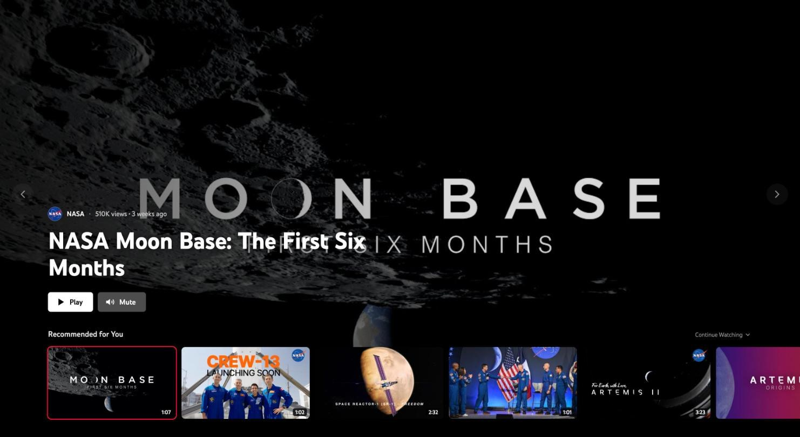
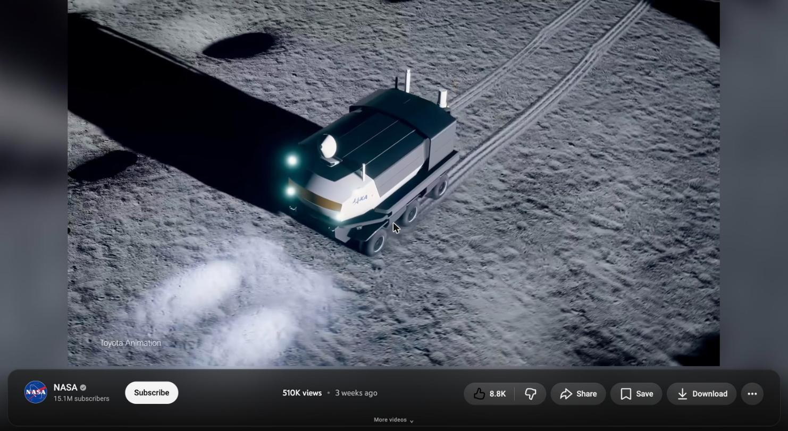
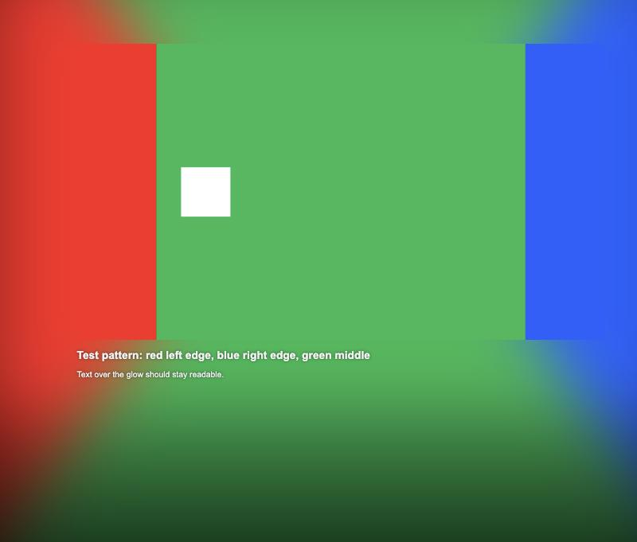
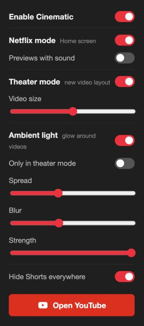

# Cinematic — a Netflix-style YouTube

A browser extension (Chrome, Brave, Edge, any Chromium browser) that turns YouTube into a cinematic, Netflix-style experience.

## Features

**Netflix mode (Home screen)**
- Full-screen hero that autoplays a preview of the selected video (starts at a "trailer" point, muted by default)
- Hover any card to make it the hero; preview starts almost instantly
- Rows: Recommended for You, Continue Watching (with progress bars), New from Subscriptions, Watch Later
- Scroll up/down (or ↑ ↓) to switch rows, swipe sideways to scroll a row, ← → to pick a video, Enter to play, M for sound
- Top bar hidden until you move the mouse to the top edge
- A different featured video on every visit

**Theater mode (new video layout)**
- The video fills most of the window (size adjustable)
- Title appears over the video when you move the mouse
- A dark glass panel under the video with the channel, views and date, and the like / share / save buttons, scaled to fit
- Recommendations become a Home-style row of cards below the fold; description and comments go full width

**Ambient light**
- The video's colours glow around the player like an Ambilight TV; the light on each side comes from that side of the picture
- Adjustable spread, blur and strength; optionally only in theater mode
- Light on the battery: tiny canvas, at most 30 fps, GPU blur

**Also**
- Works with YouTube set to light or dark, without page reloads
- Remembers where you stopped in every video and resumes there
- Hover previews are kept out of your watch history; only videos you open count
- Optional: hide Shorts everywhere

## Install

The extension isn't on the Chrome Web Store; you load it yourself (takes a minute):

1. **Download** this repository: click the green **Code** button → **Download ZIP**, then unzip it.
   (Or: `git clone https://github.com/gdorgian/CinematicForYouTube.git`)
2. Open your browser's extensions page:
   - Brave: `brave://extensions`
   - Chrome: `chrome://extensions`
   - Edge: `edge://extensions`
3. Turn on **Developer mode** (top-right toggle).
4. Click **Load unpacked** and select the unzipped `CinematicForYouTube` folder (the one that contains `manifest.json`).
5. Pin the extension (puzzle-piece icon) and open YouTube. Sign in to YouTube for the Home rows to fill.

**Updating:** download the new version, replace the folder, then click the reload arrow on the Cinematic card in the extensions page and refresh YouTube.

## Settings

Click the extension icon:

- **Enable Cinematic** — everything on/off
- **Netflix mode** — the Home screen (+ previews with sound)
- **Theater mode** — the new video layout (+ video size)
- **Ambient light** — glow around videos (+ only in theater mode, spread, blur, strength)
- **Hide Shorts everywhere**

Netflix mode and Theater mode are independent: use either one or both.

## Privacy

Everything runs locally in your browser. No servers, no analytics, no accounts. Settings sync through your browser's own extension storage; resume positions are kept in your browser's local storage on youtube.com.

## Credits

- Inspired by the "Cinematic for YouTube" extension. This is an independent rebuild, not affiliated with it.
- The ambient-light technique (edge layers + fade) follows the approach of [youtube-ambilight](https://github.com/WesselKroos/youtube-ambilight) by Wessel Kroos; the code here is a separate, lightweight implementation.
- Not affiliated with or endorsed by YouTube, Google or Netflix. YouTube is a trademark of Google LLC; Netflix is a trademark of Netflix, Inc.

## License

MIT — see [LICENSE](LICENSE).
